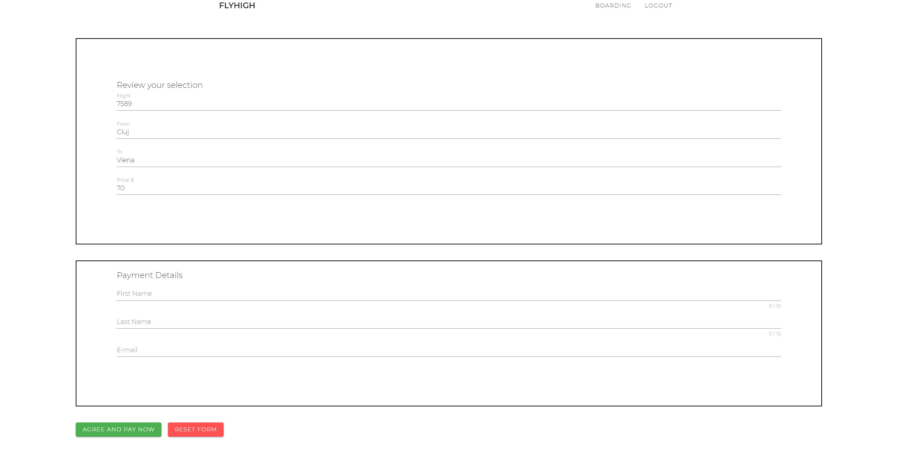

# Airline-Reservation-System
Web application. Worked with Java, Spring and Hibernate ORM for backend and HTML, JavaScript, VueJs for frontend.

# Home page of the application

# Gallery 
For my application to look as good as possible, I have added a gallery section.

# Boarding page
The user serches for a flight.If the flight is found, he selects it.

# Form

# Stripe
I have used test cards to simulate a successful payment/ failed payment.

# Technologies used

